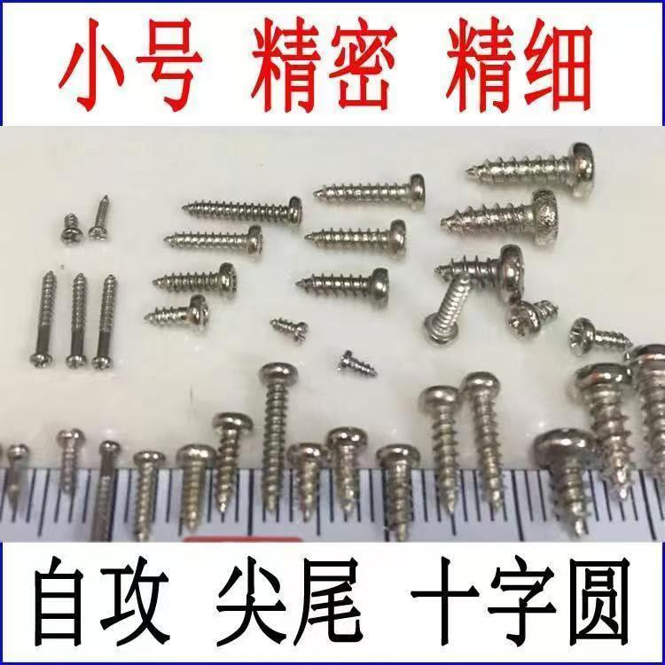

# 中兴F50电源、散热、封装改装方案

## 准备材料

> 1. 5V充放电一体电源模块
> 2. 5V升压模块
> 3. 12MM自锁开关
> 4. 中兴F50
> 5. TYPE-C母座
> 6. 3.7V锂电池
> 7. 40*40散热风扇
> 8. 1.7MM*4MM自攻螺丝
> 9. 3D打印外壳
> 10. 导线若干

## 材料样式图

#### 一、5V充放电一体电源模块5V

此模块可替换，可用和5V升压模块一样的模块

#### 二、5V升压模块

此模块可替换，保证能将3.7v升压为5V输出即可（确保输出总功率起码有4W）

#### 三、12MM自锁开关

!

若购买的5V升压模块不支持key引脚也可替换为自锁开关（接用电设备正极）

#### 四、中兴F50

无需多言，核心出装，此为外部电源接线图

#### 五、TYPE-C母座

不可替换

#### 六、3.7V锂电池

电池宽度不可超过60MM，高度不可超过90MM

#### 七、40*40散热风扇

不可替换

#### 八、1.7MM*4MM自攻螺丝

随意

#### 九、3D打印外壳

前往此平台自取

](images/README/1750519123783.png)
